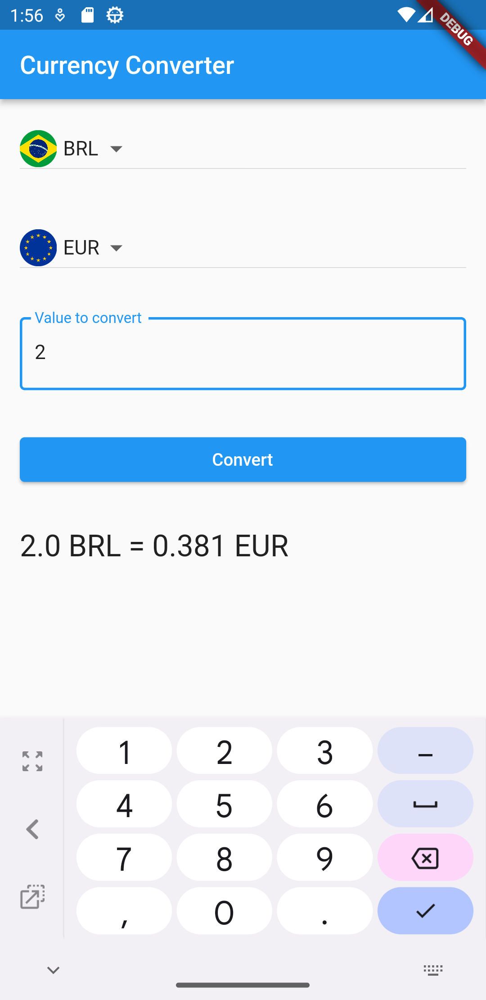

# Currency Converter App

The Currency Converter App is a simple Flutter application that allows users to convert currency values between different currencies.

## Features

- Effortlessly convert currency values across various currencies.
- Select source and target currencies using intuitive dropdown menus.
- Input the value you wish to convert with ease.
- View the converted value based on the latest exchange rates.

## Screenshots



## How to Run

To run the Currency Converter App on your local machine, make sure you have Flutter installed. If you don't have Flutter installed, you can follow the installation instructions [here](https://flutter.dev/docs/get-started/install).

1. Clone this repository:

```bash
git clone https://github.com/gss214/currency-converter.git
```

2. Navigate to the project directory:

```bash
cd currency-converter
```

3. Install dependecies:

```bash
flutter pub get
```

4. Run the app:

```bash
flutter run
```

This will launch the app on an available emulator or connected device.
